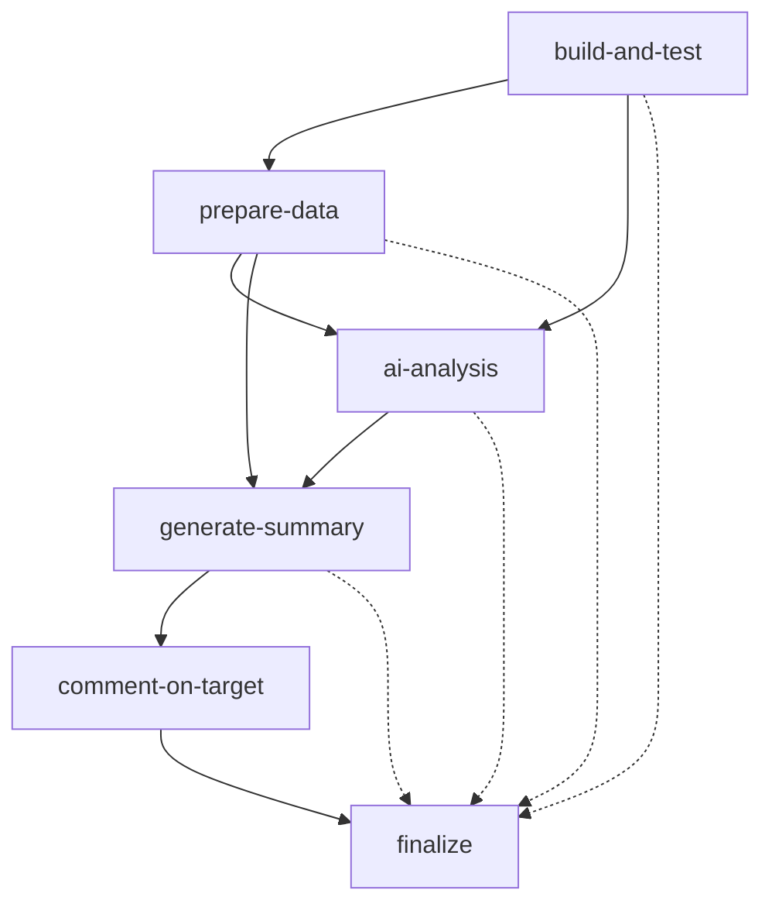

# 🏗️ Guía de Orquestación de Workflows - Nivel 2

## 📖 Introducción

Este documento explica cómo funciona la **orquestación avanzada de workflows** en GitHub Actions, específicamente el patrón de orquestación multinivel implementado en este repositorio. También se proporciona una guía para crear nuevos agentes y skills de orquestación.

## 🎯 ¿Qué es la Orquestación de Workflows?

La orquestación de workflows es un patrón de diseño que coordina múltiples trabajos (jobs) en un flujo de trabajo automatizado, donde:

- **Jobs independientes**: Pueden ejecutarse en paralelo
- **Jobs dependientes**: Se ejecutan secuencialmente basándose en resultados previos
- **Comunicación entre jobs**: Utilizando outputs, artifacts y variables de entorno
- **Orquestación inteligente**: Decisiones dinámicas basadas en resultados intermedios

## 🏰 Workflow de Orquestación Actual: `maven.yml`

### Arquitectura General

El workflow actual (`maven.yml`) implementa una **orquestación de 6 fases** con dependencias entre jobs:



### Fase 1: 🔨 Build and Test (`build-and-test`)

**Responsabilidad**: Construcción, ejecución de pruebas y generación de reportes

**Tecnologías**:
- Maven para build
- JUnit 5 para testing
- Jacoco para cobertura

**Outputs Generados**:
```yaml
outputs:
  tests-total: ${{ steps.extract-metrics.outputs.tests-total }}
  tests-errors: ${{ steps.extract-metrics.outputs.tests-errors }}
  tests-failures: ${{ steps.extract-metrics.outputs.tests-failures }}
  coverage-percentage: ${{ steps.extract-coverage.outputs.coverage }}
```

**Artefactos Preservados**:
- `target/surefire-reports/` - Reportes XML de pruebas
- `target/site/jacoco/` - Reportes de cobertura

**Steps Clave**:
1. Checkout del código
2. Setup de Java 17
3. Ejecución de `mvn clean test`
4. Extracción de métricas de pruebas (XML parsing)
5. Generación de reporte Jacoco
6. Extracción de porcentaje de cobertura
7. Upload de artifacts para jobs posteriores

**Criterios de Éxito**:
- Todas las pruebas deben ejecutarse
- Porcentaje de fallos < 10%
- Generación exitosa de reportes

### Fase 2: 📜 Prepare Data (`prepare-data`)

**Responsabilidad**: Descargar artefactos y preparar datos para análisis de IA

**Dependencias**: `needs: build-and-test`

**Outputs Generados**:
```yaml
outputs:
  xml-content: ${{ steps.read-xml.outputs.XML_CONTENT }}
  coverage-content: ${{ steps.read-coverage.outputs.COVERAGE_CONTENT }}
  file-exists: ${{ steps.check-files.outputs.exists }}
```

**Steps Clave**:
1. Checkout del código
2. Download de artifacts del job anterior
3. Verificación de existencia de archivos XML
4. Lectura y parsing de métricas esenciales (no contenido completo)
5. Extracción de métricas de cobertura Jacoco
6. Formateo de datos para consumo por IA

**Patrón Importante**: Este job **NO** pasa el contenido XML completo (para evitar límites de tamaño), sino solo métricas agregadas:

```yaml
echo "=== RESUMEN DE PRUEBAS ==="
echo "Total: $(grep -o 'tests="[0-9]\+"' ... | awk '{s+=$1} END {print s}')"
echo "Errores: $(grep -o 'errors="[0-9]\+"' ... | awk '{s+=$1} END {print s}')"
```

### Fase 3: 🤖 AI Analysis (`ai-analysis`)

**Responsabilidad**: Análisis inteligente de resultados usando IA

**Dependencias**: `needs: [build-and-test, prepare-data]`

**Permisos Requeridos**:
```yaml
permissions:
  contents: read
  models: read
```

**Action Utilizada**: `actions/ai-inference@v2.0.1`

**Configuración de IA**:

```yaml
system-prompt: |
  Eres un sabio maestro de las artes del testing y desarrollo de software.
  Analiza los resultados de pruebas JUnit y cobertura de código.

prompt: |
  Analiza estos resultados y genera un informe conciso:
  **📊 MÉTRICAS:**
  - Pruebas: ${{ needs.build-and-test.outputs.tests-total }}
  - Errores: ${{ needs.build-and-test.outputs.tests-errors }}
  - Cobertura: ${{ needs.build-and-test.outputs.coverage-percentage }}%
```

**Outputs Generados**:
```yaml
outputs:
  ai-response: ${{ steps.inference.outputs.response }}
```

**Secretos Utilizados**:
- `GITHUB_TOKEN` (automático)
- `OPENAI_API_KEY` (manual configuration)

### Fase 4: 📋 Generate Summary (`generate-summary`)

**Responsabilidad**: Crear resumen del workflow en `$GITHUB_STEP_SUMMARY`

**Dependencias**: `needs: [build-and-test, prepare-data, ai-analysis]`

**Patrón Clave**: Este job genera un resumen **sin duplicar** el análisis de IA (que se publica en issues/PR):

```yaml
echo "## 🏰 Pipeline de Análisis con IA - Crónica de la Ejecución" >> $GITHUB_STEP_SUMMARY
echo "### 📋 Estado de los Oficios Realizados:" >> $GITHUB_STEP_SUMMARY
echo "- ✅ **build-and-test**: Completado con honor" >> $GITHUB_STEP_SUMMARY
```

### Fase 5: 💬 Comment on Target (`comment-on-target`)

**Responsabilidad**: Publicar análisis de IA en Issue o Pull Request

**Dependencias**: `needs: [build-and-test, prepare-data, ai-analysis, generate-summary]`

**Permisos Requeridos**:
```yaml
permissions:
  issues: write
  pull-requests: write
  contents: read
```

**Lógica de Decisión Dinámica**:

```yaml
- name: Preparar el contenido según el contexto de ejecución
  id: prepare-context
  run: |
    if [ "${{ github.event_name }}" = "pull_request" ]; then
      echo "context=pr" >> $GITHUB_OUTPUT
      echo "target-number=${{ github.event.number }}" >> $GITHUB_OUTPUT
    else
      echo "context=issue" >> $GITHUB_OUTPUT
      ISSUE_NUM="${{ github.event.inputs.issue_number }}"
      echo "target-number=${ISSUE_NUM:-7}" >> $GITHUB_OUTPUT
    fi
```

**Steps Condicionales**:
```yaml
- name: Inscribir en las crónicas de Pull Request
  if: steps.prepare-context.outputs.context == 'pr'
  uses: peter-evans/create-or-update-comment@v4

- name: Inscribir en las crónicas de Issue
  if: steps.prepare-context.outputs.context == 'issue'
  uses: peter-evans/create-or-update-comment@v4
```

### Fase 6: 🎯 Finalize (`finalize`)

**Responsabilidad**: Resumen final y estado de todos los jobs

**Dependencias**: `needs: [build-and-test, prepare-data, ai-analysis, generate-summary, comment-on-target]`

**Característica Especial**: `if: always()` - Se ejecuta siempre, incluso si hay fallos

**Propósito**:
- Reportar estado final de cada job
- Determinar el contexto de ejecución (PR vs Issue)
- Proporcionar resumen ejecutivo del pipeline

```yaml
echo "- build-and-test: ${{ needs.build-and-test.result }}" >> $GITHUB_STEP_SUMMARY
echo "- prepare-data: ${{ needs.prepare-data.result }}" >> $GITHUB_STEP_SUMMARY
```

## 🔄 Patrones de Orquestación Implementados

### 1. **Patrón de Cadena (Chain Pattern)**

Jobs ejecutados secuencialmente donde cada uno depende del anterior:

```yaml
build-and-test → prepare-data → ai-analysis → generate-summary → comment-on-target → finalize
```

**Ventajas**:
- Flujo claro y predecible
- Fácil debugging
- Datos fluyen naturalmente

**Desventajas**:
- Mayor tiempo total de ejecución
- Un fallo detiene la cadena completa

### 2. **Patrón de Fan-Out/Fan-In**

Un job alimenta múltiples jobs en paralelo, que luego convergen:

```yaml
build-and-test ──┬──> prepare-data ──┐
                 └──> ai-analysis ────┼──> generate-summary
```

**Implementación en el código**:
```yaml
ai-analysis:
  needs: [build-and-test, prepare-data]  # Fan-in: espera dos jobs
```

### 3. **Patrón de Artefactos Compartidos**

Datos pesados se pasan vía artifacts, no outputs:

```yaml
# Job 1: Producir
- uses: actions/upload-artifact@v4
  with:
    name: resultados-pruebas-y-cobertura
    path: |
      target/surefire-reports/
      target/site/jacoco/

# Job 2: Consumir
- uses: actions/download-artifact@v4
  with:
    name: resultados-pruebas-y-cobertura
    path: target/
```

**Cuándo usar artifacts vs outputs**:
- **Outputs**: Datos pequeños (strings, números, flags) < 1MB
- **Artifacts**: Archivos, reportes, binarios > 1MB

### 4. **Patrón de Contexto Dinámico**

El workflow adapta su comportamiento según el trigger:

```yaml
on:
  push:
    branches: [ "main" ]
  pull_request:
    branches: [ "main" ]
  workflow_dispatch:
    inputs:
      issue_number:
        description: 'Número de la issue'
        required: false
        default: '7'
```

**Decisiones en tiempo de ejecución**:
```yaml
if [ "${{ github.event_name }}" = "pull_request" ]; then
  # Lógica para PR
else
  # Lógica para push/manual
fi
```

### 5. **Patrón de Cleanup/Finalization**

Job final que siempre se ejecuta para reportar estado:

```yaml
finalize:
  if: always()  # Ejecutar incluso si hay fallos anteriores
  needs: [todos-los-otros-jobs]
```

## 🛠️ Cómo Crear un Nuevo Workflow de Orquestación

### Paso 1: Definir la Arquitectura

**Preguntas clave**:
1. ¿Cuántas fases necesito?
2. ¿Qué fases pueden ejecutarse en paralelo?
3. ¿Qué datos deben compartirse entre fases?
4. ¿Necesito IA u otras integraciones externas?
5. ¿Dónde se publicarán los resultados?

**Ejemplo de diseño**:

```yaml
# Workflow: Análisis de Seguridad Multinivel

Fase 1: security-scan (paralelo con static-analysis)
Fase 2: static-analysis (paralelo con security-scan)
Fase 3: aggregate-results (necesita: security-scan, static-analysis)
Fase 4: ai-recommendations (necesita: aggregate-results)
Fase 5: create-report (necesita: ai-recommendations)
```

### Paso 2: Crear la Estructura Base

```yaml
name: Mi Workflow de Orquestación

on:
  push:
    branches: [ "main" ]
  pull_request:
    branches: [ "main" ]
  workflow_dispatch:
    inputs:
      # Inputs personalizados
      environment:
        description: 'Entorno de ejecución'
        required: true
        default: 'development'

jobs:
  # Aquí irán los jobs
```

### Paso 3: Implementar Jobs con Outputs

**Template de Job con Outputs**:

```yaml
mi-primer-job:
  name: 🔍 Mi Primer Job
  runs-on: ubuntu-latest
  outputs:
    resultado: ${{ steps.mi-step.outputs.resultado }}
    status: ${{ steps.mi-step.outputs.status }}
  
  steps:
    - name: Checkout código
      uses: actions/checkout@v4
    
    - name: Ejecutar lógica
      id: mi-step
      run: |
        # Tu lógica aquí
        resultado="éxito"
        status="completado"
        echo "resultado=$resultado" >> $GITHUB_OUTPUT
        echo "status=$status" >> $GITHUB_OUTPUT
        
        # Reportar en summary
        echo "✅ Job completado: $status" >> $GITHUB_STEP_SUMMARY
```

### Paso 4: Implementar Jobs con Dependencias

```yaml
mi-segundo-job:
  name: 📊 Procesamiento de Resultados
  runs-on: ubuntu-latest
  needs: mi-primer-job  # Dependencia
  
  steps:
    - name: Usar outputs del job anterior
      run: |
        echo "Resultado recibido: ${{ needs.mi-primer-job.outputs.resultado }}"
        echo "Status recibido: ${{ needs.mi-primer-job.outputs.status }}"
```

### Paso 5: Implementar Artifacts para Datos Grandes

```yaml
producer-job:
  steps:
    - name: Generar datos grandes
      run: |
        # Crear archivos
        echo "datos..." > resultado.json
    
    - name: Upload artifacts
      uses: actions/upload-artifact@v4
      with:
        name: mi-artifact
        path: resultado.json
        retention-days: 1  # Mantener solo 1 día

consumer-job:
  needs: producer-job
  steps:
    - name: Download artifacts
      uses: actions/download-artifact@v4
      with:
        name: mi-artifact
        path: ./downloaded/
    
    - name: Usar datos
      run: cat ./downloaded/resultado.json
```

### Paso 6: Implementar Lógica Condicional

```yaml
conditional-job:
  if: ${{ needs.mi-primer-job.outputs.status == 'completado' }}
  needs: mi-primer-job
  steps:
    - name: Ejecutar solo si status es completado
      run: echo "Ejecutando porque el status es completado"

otro-conditional-job:
  if: ${{ github.event_name == 'pull_request' }}
  steps:
    - name: Solo en PRs
      run: echo "Este job solo corre en Pull Requests"
```

### Paso 7: Implementar Job de Finalización

```yaml
finalize:
  name: 🎯 Finalización
  runs-on: ubuntu-latest
  needs: [job1, job2, job3]
  if: always()  # IMPORTANTE: siempre ejecutar
  
  steps:
    - name: Resumen final
      run: |
        echo "## Resumen de Ejecución" >> $GITHUB_STEP_SUMMARY
        echo "- Job 1: ${{ needs.job1.result }}" >> $GITHUB_STEP_SUMMARY
        echo "- Job 2: ${{ needs.job2.result }}" >> $GITHUB_STEP_SUMMARY
        echo "- Job 3: ${{ needs.job3.result }}" >> $GITHUB_STEP_SUMMARY
```

## 🤖 Cómo Crear un Agente de Orquestación

### ¿Qué es un Agente de Orquestación?

Un agente de orquestación es un componente reutilizable que encapsula:
- **Lógica de ejecución**: Qué hacer en cada fase
- **Configuración**: Parámetros y settings
- **Integración**: Cómo conectar con otros sistemas
- **Reporting**: Cómo reportar resultados

### Estructura de un Agente

**Archivo**: `.github/agents/mi-agente.agent.md`

```markdown
---
name: mi-agente
description: 'Descripción breve del agente'
---

# 🤖 Mi Agente de Orquestación

## 🎯 Propósito

[Descripción detallada del propósito del agente]

## 🛡️ Directrices de Seguridad

[Políticas de seguridad y restricciones]

## 📋 Fases de Ejecución

### Fase 1: [Nombre de Fase]
- **Objetivo**: [Qué hace]
- **Inputs**: [Qué necesita]
- **Outputs**: [Qué produce]
- **Validaciones**: [Qué verifica]

### Fase 2: [Nombre de Fase]
...

## 🔧 Configuración Requerida

### Variables de Entorno
- `VAR1`: Descripción
- `VAR2`: Descripción

### Secrets
- `SECRET1`: Descripción

### Permisos
- `permission1`: Descripción

## 📊 Métricas y Reportes

[Qué métricas genera y cómo reporta]

## 🚀 Ejemplo de Uso

[Ejemplos concretos de cómo usar el agente]
```

### Ejemplo: Agente de Testing Multinivel

```markdown
---
name: multilevel-testing-agent
description: 'Agente que ejecuta pruebas en múltiples niveles: unitarias, integración, E2E y performance'
---

# 🧪 Multilevel Testing Agent

## 📋 Fases de Ejecución

### Fase 1: Pruebas Unitarias
- **Comando**: `mvn test -Dtest=*Test`
- **Duración estimada**: 2-5 minutos
- **Output**: `unit-tests-results`

### Fase 2: Pruebas de Integración
- **Comando**: `mvn verify -Dtest=*IntegrationTest`
- **Duración estimada**: 5-10 minutos
- **Output**: `integration-tests-results`

### Fase 3: Pruebas E2E
- **Herramienta**: Selenium/Playwright
- **Duración estimada**: 10-20 minutos
- **Output**: `e2e-tests-results`

### Fase 4: Pruebas de Performance
- **Herramienta**: JMeter/Gatling
- **Duración estimada**: 15-30 minutos
- **Output**: `performance-tests-results`

### Fase 5: Agregación y Reporte
- **Acción**: Consolidar todos los resultados
- **Generar**: Reporte unificado
- **Publicar**: En Issue o PR

## 🔧 Implementación en Workflow

\`\`\`yaml
jobs:
  unit-tests:
    name: 🧪 Pruebas Unitarias
    runs-on: ubuntu-latest
    outputs:
      tests-total: ${{ steps.extract.outputs.total }}
    steps:
      - uses: actions/checkout@v4
      - name: Ejecutar pruebas unitarias
        run: mvn test -Dtest=*Test

  integration-tests:
    name: 🔗 Pruebas de Integración
    runs-on: ubuntu-latest
    needs: unit-tests
    outputs:
      tests-total: ${{ steps.extract.outputs.total }}
    steps:
      - uses: actions/checkout@v4
      - name: Ejecutar pruebas integración
        run: mvn verify -Dtest=*IntegrationTest

  aggregate-results:
    name: 📊 Agregación de Resultados
    runs-on: ubuntu-latest
    needs: [unit-tests, integration-tests]
    steps:
      - name: Consolidar resultados
        run: |
          echo "Total Unit: ${{ needs.unit-tests.outputs.tests-total }}"
          echo "Total Integration: ${{ needs.integration-tests.outputs.tests-total }}"
\`\`\`
```

## 🎓 Skills de Orquestación

### Skill 1: Ejecución Paralela

**Cuándo usar**: Cuando tienes jobs independientes que pueden correr simultáneamente.

```yaml
jobs:
  job-a:
    runs-on: ubuntu-latest
    steps:
      - run: echo "Job A"
  
  job-b:
    runs-on: ubuntu-latest
    steps:
      - run: echo "Job B"
  
  job-c:
    runs-on: ubuntu-latest
    steps:
      - run: echo "Job C"

# Estos 3 jobs corren en paralelo porque no tienen dependencias
```

### Skill 2: Matrix Strategy

**Cuándo usar**: Cuando necesitas ejecutar el mismo job con diferentes configuraciones.

```yaml
test-matrix:
  strategy:
    matrix:
      os: [ubuntu-latest, windows-latest, macos-latest]
      java: [11, 17, 21]
      exclude:
        - os: macos-latest
          java: 11
  runs-on: ${{ matrix.os }}
  steps:
    - name: Setup Java ${{ matrix.java }}
      uses: actions/setup-java@v4
      with:
        java-version: ${{ matrix.java }}
    - name: Run tests
      run: mvn test
```

### Skill 3: Reusable Workflows

**Cuándo usar**: Cuando quieres compartir workflows entre repositorios.

**Archivo**: `.github/workflows/reusable-build.yml`

```yaml
name: Reusable Build Workflow

on:
  workflow_call:
    inputs:
      java-version:
        required: true
        type: string
    outputs:
      build-status:
        description: "Status del build"
        value: ${{ jobs.build.outputs.status }}

jobs:
  build:
    runs-on: ubuntu-latest
    outputs:
      status: ${{ steps.build-step.outputs.status }}
    steps:
      - uses: actions/checkout@v4
      - uses: actions/setup-java@v4
        with:
          java-version: ${{ inputs.java-version }}
      - name: Build
        id: build-step
        run: |
          mvn clean package
          echo "status=success" >> $GITHUB_OUTPUT
```

**Uso del workflow reusable**:

```yaml
name: Main Workflow

on: [push]

jobs:
  call-reusable:
    uses: ./.github/workflows/reusable-build.yml
    with:
      java-version: '17'
```

### Skill 4: Composite Actions

**Cuándo usar**: Cuando quieres reutilizar pasos dentro del mismo repositorio.

**Archivo**: `.github/actions/setup-test-env/action.yml`

```yaml
name: 'Setup Test Environment'
description: 'Configura el entorno para pruebas'
inputs:
  java-version:
    description: 'Versión de Java'
    required: true
    default: '17'
runs:
  using: 'composite'
  steps:
    - name: Setup Java
      uses: actions/setup-java@v4
      with:
        java-version: ${{ inputs.java-version }}
        distribution: 'temurin'
    - name: Cache Maven dependencies
      uses: actions/cache@v3
      with:
        path: ~/.m2/repository
        key: ${{ runner.os }}-maven-${{ hashFiles('**/pom.xml') }}
    - name: Setup test database
      shell: bash
      run: |
        echo "Setting up test DB..."
```

**Uso del composite action**:

```yaml
jobs:
  test:
    runs-on: ubuntu-latest
    steps:
      - uses: actions/checkout@v4
      - uses: ./.github/actions/setup-test-env
        with:
          java-version: '17'
      - run: mvn test
```

### Skill 5: Dynamic Job Creation

**Cuándo usar**: Cuando el número de jobs depende de datos dinámicos.

```yaml
discover-modules:
  runs-on: ubuntu-latest
  outputs:
    modules: ${{ steps.find-modules.outputs.modules }}
  steps:
    - uses: actions/checkout@v4
    - name: Find modules
      id: find-modules
      run: |
        modules=$(find . -name "pom.xml" -not -path "*/target/*" | jq -R -s -c 'split("\n")[:-1]')
        echo "modules=$modules" >> $GITHUB_OUTPUT

test-modules:
  needs: discover-modules
  runs-on: ubuntu-latest
  strategy:
    matrix:
      module: ${{ fromJson(needs.discover-modules.outputs.modules) }}
  steps:
    - uses: actions/checkout@v4
    - name: Test module
      run: mvn test -f ${{ matrix.module }}
```

## 📊 Mejores Prácticas de Orquestación

### 1. **Nomenclatura Clara**

```yaml
# ❌ Malo
job1:
  name: j1

# ✅ Bueno
build-and-test:
  name: 🔨 Construcción y Pruebas del Códice
```

### 2. **Logging Abundante**

```yaml
steps:
  - name: Mi paso importante
    run: |
      echo "🚀 Iniciando proceso..." >> $GITHUB_STEP_SUMMARY
      # Tu código
      echo "✅ Proceso completado" >> $GITHUB_STEP_SUMMARY
```

### 3. **Timeouts Apropiados**

```yaml
jobs:
  my-job:
    timeout-minutes: 30  # Prevenir jobs colgados
    steps:
      - name: Long operation
        timeout-minutes: 10  # Timeout específico para step
```

### 4. **Manejo de Errores**

```yaml
steps:
  - name: Step que puede fallar
    continue-on-error: true  # No detener workflow si falla
    run: ./script-que-puede-fallar.sh
  
  - name: Step crítico
    run: ./script-critico.sh
    # Si falla, detiene el workflow (comportamiento por defecto)
```

### 5. **Seguridad en Secrets**

```yaml
# ❌ Malo: exponer secrets en logs
run: echo "API Key: ${{ secrets.API_KEY }}"

# ✅ Bueno: usar secrets sin exponerlos
env:
  API_KEY: ${{ secrets.API_KEY }}
run: |
  # Usar $API_KEY en el script sin hacer echo
  curl -H "Authorization: Bearer $API_KEY" https://api.example.com
```

### 6. **Optimización de Artifacts**

```yaml
# ❌ Malo: subir demasiados artifacts innecesarios
- uses: actions/upload-artifact@v4
  with:
    name: everything
    path: |
      **/*
      target/
      node_modules/

# ✅ Bueno: solo lo necesario
- uses: actions/upload-artifact@v4
  with:
    name: test-reports
    path: target/surefire-reports/*.xml
    retention-days: 1  # Limpiar rápidamente
```

### 7. **Caching Inteligente**

```yaml
- name: Cache Maven dependencies
  uses: actions/cache@v3
  with:
    path: ~/.m2/repository
    key: ${{ runner.os }}-maven-${{ hashFiles('**/pom.xml') }}
    restore-keys: |
      ${{ runner.os }}-maven-
```

## 🔍 Debugging de Workflows

### Técnica 1: Debug Logging

```yaml
- name: Debug environment
  run: |
    echo "Event name: ${{ github.event_name }}"
    echo "Ref: ${{ github.ref }}"
    echo "Actor: ${{ github.actor }}"
    env | sort
```

### Técnica 2: Artifact de Debug

```yaml
- name: Save debug info
  if: failure()
  uses: actions/upload-artifact@v4
  with:
    name: debug-logs
    path: |
      *.log
      target/surefire-reports/
```

### Técnica 3: Step Summary para Troubleshooting

```yaml
- name: Troubleshooting info
  if: always()
  run: |
    echo "## 🔍 Debug Information" >> $GITHUB_STEP_SUMMARY
    echo "- Runner OS: ${{ runner.os }}" >> $GITHUB_STEP_SUMMARY
    echo "- Job status: ${{ job.status }}" >> $GITHUB_STEP_SUMMARY
    echo "- Timestamp: $(date)" >> $GITHUB_STEP_SUMMARY
```

## 📈 Métricas y Monitoreo

### Métricas Clave a Trackear

1. **Duración de Jobs**
```yaml
- name: Record duration
  run: |
    echo "Job duration: ${{ steps.start-time.outputs.time }} - $(date +%s)"
```

2. **Tasa de Éxito**
```yaml
- name: Record success rate
  run: |
    total=${{ needs.build-and-test.outputs.tests-total }}
    failed=${{ needs.build-and-test.outputs.tests-failures }}
    success_rate=$((100 * (total - failed) / total))
    echo "Success rate: $success_rate%" >> $GITHUB_STEP_SUMMARY
```

3. **Uso de Recursos**
```yaml
- name: Check resources
  run: |
    echo "Disk usage: $(df -h /)" >> $GITHUB_STEP_SUMMARY
    echo "Memory usage: $(free -h)" >> $GITHUB_STEP_SUMMARY
```

## 🚀 Ejemplos de Casos de Uso

### Caso 1: CI/CD Completo con Despliegue

```yaml
name: Complete CI/CD Pipeline

on:
  push:
    branches: [main]

jobs:
  test:
    runs-on: ubuntu-latest
    steps:
      - uses: actions/checkout@v4
      - run: mvn test
  
  build:
    needs: test
    runs-on: ubuntu-latest
    steps:
      - uses: actions/checkout@v4
      - run: mvn package
      - uses: actions/upload-artifact@v4
        with:
          name: app-jar
          path: target/*.jar
  
  deploy-staging:
    needs: build
    environment: staging
    runs-on: ubuntu-latest
    steps:
      - uses: actions/download-artifact@v4
        with:
          name: app-jar
      - name: Deploy to staging
        run: ./deploy-staging.sh
  
  smoke-tests:
    needs: deploy-staging
    runs-on: ubuntu-latest
    steps:
      - name: Run smoke tests
        run: ./smoke-tests.sh staging
  
  deploy-production:
    needs: smoke-tests
    environment: production
    runs-on: ubuntu-latest
    steps:
      - uses: actions/download-artifact@v4
        with:
          name: app-jar
      - name: Deploy to production
        run: ./deploy-prod.sh
```

### Caso 2: Análisis de Seguridad Multinivel

```yaml
name: Security Analysis

on:
  pull_request:

jobs:
  dependency-check:
    runs-on: ubuntu-latest
    steps:
      - uses: actions/checkout@v4
      - name: OWASP Dependency Check
        run: mvn dependency-check:check
  
  sast-scan:
    runs-on: ubuntu-latest
    steps:
      - uses: actions/checkout@v4
      - name: SonarQube Scan
        run: mvn sonar:sonar
  
  container-scan:
    runs-on: ubuntu-latest
    steps:
      - uses: actions/checkout@v4
      - name: Trivy Container Scan
        run: trivy image my-app:latest
  
  aggregate-security-results:
    needs: [dependency-check, sast-scan, container-scan]
    runs-on: ubuntu-latest
    steps:
      - name: Aggregate results
        run: echo "All security scans completed"
```

## 📚 Referencias y Recursos

### Documentación Oficial
- [GitHub Actions Documentation](https://docs.github.com/en/actions)
- [Workflow Syntax](https://docs.github.com/en/actions/reference/workflow-syntax-for-github-actions)
- [Contexts and Expressions](https://docs.github.com/en/actions/learn-github-actions/contexts)

### Actions Útiles
- `actions/checkout@v4` - Checkout código
- `actions/upload-artifact@v4` - Upload artifacts
- `actions/download-artifact@v4` - Download artifacts
- `actions/cache@v3` - Caching
- `actions/setup-java@v4` - Setup Java
- `peter-evans/create-or-update-comment@v4` - Comentarios en Issues/PRs

### Ejemplos en este Repositorio
- `.github/workflows/maven.yml` - Workflow principal con orquestación de 6 fases
- `.github/agents/pipeline-cicd.agent.md` - Agente CI/CD especializado
- `WORKFLOW_IMPROVEMENTS_SUMMARY.md` - Resumen de mejoras implementadas

## 🎯 Checklist para Crear un Workflow de Orquestación

- [ ] Definir arquitectura de fases y dependencias
- [ ] Identificar qué jobs pueden ejecutarse en paralelo
- [ ] Definir outputs necesarios para cada job
- [ ] Determinar qué datos se pasan vía outputs vs artifacts
- [ ] Implementar logging en `$GITHUB_STEP_SUMMARY`
- [ ] Añadir manejo de errores y timeouts
- [ ] Implementar job de finalización con `if: always()`
- [ ] Configurar permisos apropiados para cada job
- [ ] Definir triggers (push, PR, workflow_dispatch)
- [ ] Documentar el workflow en markdown
- [ ] Añadir ejemplos de uso
- [ ] Testear el workflow con diferentes escenarios
- [ ] Optimizar uso de artifacts y caching
- [ ] Añadir métricas y monitoreo

---

**Documento creado**: 2024  
**Basado en**: Workflow `maven.yml` del repositorio poc-springboot-sum-integers  
**Versión**: 2.0
