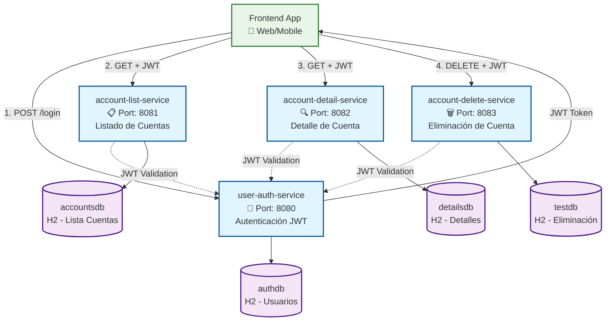
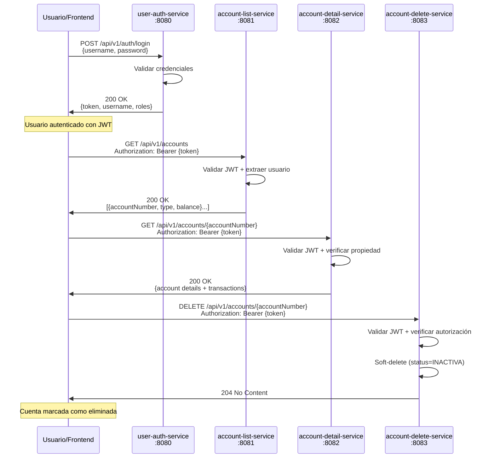
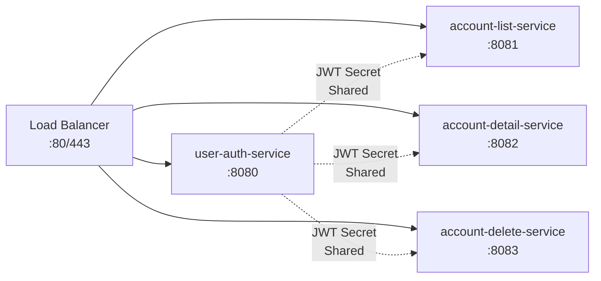

# 📋 Documentación Completa del Proyecto - Arquitectura de Microservicios

*Generado automáticamente desde Copilot Space `jon-space-documentation`*

## 1. Executive Summary

**Proyecto**: Portal Bancario - Arquitectura de Microservicios  
**Equipo**: BBVA AI - Plataforma Spaces de Accenture  
**Scope**: Sistema completo de autenticación, gestión de cuentas y operaciones bancarias  
**Status**: En desarrollo activo con implementación completa de 4 microservicios principales

## 2. Arquitectura & Stack Tecnológico

### **Frontend**
- En desarrollo (pendiente de definición)
- Integración prevista con autenticación JWT

### **Backend**
- **Java**: 17+
- **Framework**: Spring Boot 3.2.x
- **Seguridad**: Spring Security 6.x con JWT (JSON Web Tokens)
- **Persistencia**: Spring Data JPA
- **Build Tool**: Maven
- **Otras**: Lombok para reducción de boilerplate

### **Bases de Datos**
- **Desarrollo**: H2 Database (in-memory)
- **Producción**: PostgreSQL/MySQL (configuración pendiente)

### **Infrastructure**
- **Containerización**: Docker con multi-stage builds
- **Seguridad**: Non-root users, health checks

### **CI/CD Tools**
- **GitHub Actions**: Pipelines automatizados
- **Maven**: Testing y build automation
- **Flyway**: Gestión de migraciones de BD

## 3. Arquitectura de Microservicios - Relaciones y Dependencias

### **📊 Diagrama de Relaciones entre Microservicios**



### **🔗 Interconexiones y Dependencias**

## **Microservicio 1: user-auth-service (Puerto 8080)**

**Responsabilidades**:
- ✅ Autenticación de usuarios con credenciales
- ✅ Generación de tokens JWT con claims de usuario y roles
- ✅ Validación de tokens JWT para otros servicios
- ✅ Gestión de usuarios y roles

**Endpoints**:
- `POST /api/v1/auth/login` - Autenticación y generación de JWT
- `POST /api/v1/auth/validate` - Validación de tokens JWT

**Datos clave**:
- **Base de datos**: `authdb` (usuarios, contraseñas hasheadas, roles)
- **JWT Secret**: Clave compartida para firma/validación de tokens
- **Usuarios de prueba**: `usuario123`, `admin`, `testuser`

**Dependencias**:
- ⚠️ **Punto crítico**: Todos los demás microservicios dependen de este para validación JWT

---

## **Microservicio 2: account-list-service (Puerto 8081)**

**Responsabilidades**:
- ✅ Listar cuentas bancarias del usuario autenticado
- ✅ Resumen básico de cuentas (número, tipo, saldo)
- ✅ Filtrado por usuario (basado en JWT)

**Endpoints**:
- `GET /api/v1/accounts` - Lista de cuentas del usuario

**Datos clave**:
- **Base de datos**: `accountsdb` - tabla accounts con relación `userId`
- **Autorización**: Solo cuentas del usuario autenticado
- **Datos de prueba**: Cuentas para `testuser` y `user2`

**Dependencias**:
- 🔐 **user-auth-service**: Para validación JWT
- 📊 **Frontend**: Consume este endpoint para dashboard principal

---

## **Microservicio 3: account-detail-service (Puerto 8082)**

**Responsabilidades**:
- ✅ Detalles completos de una cuenta específica
- ✅ Historial de transacciones recientes (últimas 10)
- ✅ Verificación de propiedad de cuenta

**Endpoints**:
- `GET /api/v1/accounts/{accountNumber}` - Detalles completos de cuenta

**Datos clave**:
- **Base de datos**: `detailsdb` - tablas accounts y transactions
- **Autorización**: Solo propietario puede ver detalles
- **Datos de prueba**: Cuentas con transacciones para testing

**Dependencias**:
- 🔐 **user-auth-service**: Para validación JWT  
- 📋 **account-list-service**: Frontend navega desde lista a detalle
- 💳 **Transacciones**: Depende de sistema de transacciones (futuro)

---

## **Microservicio 4: account-delete-service (Puerto 8083)**

**Responsabilidades**:
- ✅ Eliminación segura de cuentas (soft-delete)
- ✅ Autorización avanzada (propietario + ROLE_ADMIN)
- ✅ Operaciones idempotentes y transaccionales

**Endpoints**:
- `DELETE /api/v1/accounts/{accountNumber}` - Eliminación de cuenta

**Datos clave**:
- **Base de datos**: `testdb` - tabla accounts con campos `deleted_at` y `status`
- **Soft-delete**: Marca como `INACTIVA` sin borrado físico
- **Autorización**: Propietario O usuario con `ROLE_ADMIN`

**Dependencias**:
- 🔐 **user-auth-service**: Para validación JWT y extracción de roles
- 📋 **account-list-service**: Cuentas eliminadas no aparecen en listado
- 📊 **Eventos**: Futura publicación de eventos `account.deleted`

## 4. Flujos de Proceso y Workflows

### **🔄 Workflow Principal - Gestión de Cuentas**



### **🔐 Flujo de Autorización Compartida**

**Patrón JWT Común**:
1. **Clave secreta compartida**: `jwt.secret.key` en todos los microservicios
2. **Algoritmo**: HS256 (HMAC with SHA-256)
3. **Claims estándar**: `subject` (username), `iat`, `exp`
4. **Validación local**: Cada servicio valida independientemente

**Filtros de seguridad**:
- `JwtAuthenticationFilter` implementado consistentemente
- Extracción de `Authorization: Bearer {token}`
- Configuración de `SecurityContextHolder`

## 5. Configuración y Despliegue

### **🔧 Variables de Entorno Críticas**

| Variable | Servicio | Default | Descripción |
|----------|----------|---------|-------------|
| `JWT_SECRET_KEY` | **TODOS** | `ESTA_ES_UNA_CLAVE_SECRETA_MUY_LARGA_PARA_DESARROLLO` | ⚠️ **CRÍTICO**: Debe ser igual en todos |
| `JWT_EXPIRATION_MS` | user-auth | `3600000` | Duración del token (1 hora) |
| `SERVER_PORT` | user-auth | `8080` | Puerto de autenticación |
| `SERVER_PORT` | account-list | `8081` | Puerto de listado |
| `SERVER_PORT` | account-detail | `8082` | Puerto de detalle |
| `SERVER_PORT` | account-delete | `8083` | Puerto de eliminación |

### **🐳 Estrategia de Contenedores**

**Imagen base común**: `eclipse-temurin:17-jre-jammy`
**Patrón de seguridad**: Non-root user (`appuser`)
**Health checks**: Endpoint `/actuator/health`
**Multi-stage builds**: Optimización de tamaño de imagen

### **📊 Puertos y Networking**



## 6. Testing y Calidad

### **🧪 Estrategia de Testing**

**Cobertura por microservicio**:
- **user-auth-service**: Tests de autenticación y generación JWT
- **account-list-service**: Tests de listado y filtrado por usuario
- **account-detail-service**: Tests de detalle y transacciones
- **account-delete-service**: Tests de soft-delete y autorización

**Patrones de testing comunes**:
- `@SpringBootTest` para integration tests
- `@WebMvcTest` para controller tests
- `MockMvc` para simulación HTTP
- `@MockBean` para dependencies
- H2 in-memory para testing de BD

### **📈 CI/CD Pipeline**

**GitHub Actions workflow**:
1. **Build**: `mvn clean compile`
2. **Test**: `mvn test` (unit + integration)
3. **Quality**: Checkstyle, SpotBugs
4. **Package**: `mvn package`
5. **Docker**: Build y push de imágenes
6. **Deploy**: Automatizado en entornos de desarrollo

## 7. Roadmap y Mejoras Identificadas

### **⚠️ Elementos Críticos Pendientes**

**Seguridad**:
- [ ] **Rotación de JWT secrets** en producción
- [ ] **Rate limiting** en endpoints de autenticación
- [ ] **Audit logging** para operaciones críticas

**Integración**:
- [ ] **API Gateway** para routing centralizado
- [ ] **Service discovery** (Eureka/Consul)
- [ ] **Circuit breakers** (Hystrix/Resilience4j)

**Datos**:
- [ ] **Database clustering** para alta disponibilidad
- [ ] **Backup strategies** para bases de datos
- [ ] **Migration from H2 to PostgreSQL** para producción

### **🚀 Features Avanzadas**

**Messaging & Events**:
- [ ] **Event publishing** para `account.deleted`, `account.created`
- [ ] **Kafka/RabbitMQ** integration
- [ ] **Event sourcing** para audit trail

**Monitoring & Observability**:
- [ ] **Distributed tracing** (Zipkin/Jaeger)
- [ ] **Metrics collection** (Prometheus/Grafana)
- [ ] **Centralized logging** (ELK Stack)

**Business Logic**:
- [ ] **Account creation service** (nuevo microservicio)
- [ ] **Transaction processing service** (nuevo microservicio)
- [ ] **Notification service** (email/SMS)

## 8. Documentación de Referencia

### **📚 Recursos de Desarrollo**

**Repositorios**:
- `accenture-amer-extending-copilot/poc-springboot-sum-integers` (proyecto base)
- Microservicios individuales en organización Accenture

**Patrones y Convenciones**:
- **Package naming**: `com.{company}.spaces.{service}`
- **JWT property**: `jwt.secret.key` (consistente)
- **Error handling**: Centralized con `@ControllerAdvice`
- **Database naming**: `{service}db` pattern

**API Standards**:
- **Base path**: `/api/v1/{resource}`
- **HTTP methods**: RESTful (GET, POST, DELETE)
- **Response codes**: Estándar HTTP (200, 204, 401, 403, 404)
- **JWT header**: `Authorization: Bearer {token}`

## 9. Código de Ejemplo - Componentes Clave

### **🔐 Configuración JWT Común**

```java
// JwtUtil.java - Patrón común en todos los microservicios
@Component
public class JwtUtil {
    @Value("${jwt.secret.key}")
    private String secretKey;

    public String extractUsername(String token) {
        return extractAllClaims(token).getSubject();
    }

    public boolean validateToken(String token) {
        try {
            return !isTokenExpired(token);
        } catch (Exception e) {
            return false;
        }
    }

    private Claims extractAllClaims(String token) {
        return Jwts.parser()
                .verifyWith(getSigningKey())
                .build()
                .parseSignedClaims(token)
                .getPayload();
    }

    private SecretKey getSigningKey() {
        return Keys.hmacShaKeyFor(secretKey.getBytes());
    }
}
```

### **🛡️ Filtro de Autenticación**

```java
// JwtAuthenticationFilter.java - Patrón común
@Component
public class JwtAuthenticationFilter extends OncePerRequestFilter {
    private final JwtUtil jwtUtil;

    @Override
    protected void doFilterInternal(HttpServletRequest request, 
                                  HttpServletResponse response, 
                                  FilterChain filterChain) throws ServletException, IOException {
        final String authHeader = request.getHeader("Authorization");
        
        if (authHeader != null && authHeader.startsWith("Bearer ")) {
            String jwt = authHeader.substring(7);
            if (jwtUtil.validateToken(jwt)) {
                String username = jwtUtil.extractUsername(jwt);
                UsernamePasswordAuthenticationToken authToken = 
                    new UsernamePasswordAuthenticationToken(username, null, new ArrayList<>());
                SecurityContextHolder.getContext().setAuthentication(authToken);
            }
        }
        filterChain.doFilter(request, response);
    }
}
```

### **📊 Estructura de Entidades**

```java
// Account.java - Entidad común con variaciones
@Entity
@Table(name = "accounts")
@Data
public class Account {
    @Id
    @Column(name = "account_number")
    private String accountNumber;
    
    @Column(name = "owner_username", nullable = false)
    private String ownerUsername;
    
    @Column(name = "account_type", nullable = false)
    private String accountType;
    
    @Column(name = "balance", precision = 19, scale = 2)
    private BigDecimal balance;
    
    @Column(name = "currency")
    private String currency = "USD";
    
    @Column(name = "status")
    private String status = "ACTIVA";
    
    // Para soft-delete (solo en account-delete-service)
    @Column(name = "deleted_at")
    private Instant deletedAt;
}
```

### **⚙️ Configuración de Seguridad**

```java
// SecurityConfig.java - Patrón común
@Configuration
@EnableWebSecurity
public class SecurityConfig {
    private final JwtAuthenticationFilter jwtAuthenticationFilter;

    @Bean
    public SecurityFilterChain filterChain(HttpSecurity http) throws Exception {
        http
            .csrf(csrf -> csrf.disable())
            .sessionManagement(session -> session.sessionCreationPolicy(SessionCreationPolicy.STATELESS))
            .authorizeHttpRequests(authz -> authz
                .requestMatchers("/h2-console/**").permitAll()
                .requestMatchers("/api/v1/**").authenticated()
                .anyRequest().permitAll()
            )
            .addFilterBefore(jwtAuthenticationFilter, UsernamePasswordAuthenticationFilter.class);
        return http.build();
    }
}
```

## 10. Guías de Desarrollo

### **🚀 Setup de Desarrollo Local**

**Prerrequisitos**:
```bash
# Java 17+
java -version

# Maven 3.6+
mvn -version

# Docker (opcional)
docker --version
```

**Orden de inicio de servicios**:
```bash
# 1. Servicio de autenticación (CRÍTICO - debe estar primero)
cd user-auth-service
mvn spring-boot:run  # Puerto 8080

# 2. Servicio de listado de cuentas
cd account-list-service  
mvn spring-boot:run  # Puerto 8081

# 3. Servicio de detalle de cuentas
cd account-detail-service
mvn spring-boot:run  # Puerto 8082

# 4. Servicio de eliminación de cuentas
cd account-delete-service
mvn spring-boot:run  # Puerto 8083
```

### **🔧 Variables de Entorno para Desarrollo**

```bash
# .env file común para todos los servicios
JWT_SECRET_KEY=ESTA_ES_UNA_CLAVE_SECRETA_MUY_LARGA_PARA_DESARROLLO
JWT_EXPIRATION_MS=3600000
SPRING_PROFILES_ACTIVE=development
SPRING_DATASOURCE_URL=jdbc:h2:mem:${service}db
SPRING_DATASOURCE_USERNAME=sa
SPRING_DATASOURCE_PASSWORD=password
```

### **🧪 Testing Workflow**

```bash
# Tests unitarios
mvn test

# Tests de integración
mvn verify

# Coverage report
mvn jacoco:report

# Verificar cobertura mínima (80%)
mvn jacoco:check
```

### **📦 Build y Deploy**

```bash
# Build local
mvn clean package

# Build Docker image
docker build -t ${service-name}:latest .

# Run container
docker run -p ${port}:${port} ${service-name}:latest
```

---

## 🔍 Conclusiones

Esta arquitectura de microservicios implementa un **sistema bancario modular y seguro** con:

✅ **4 microservicios funcionales** con responsabilidades claramente definidas  
✅ **Autenticación JWT centralizada** con validación distribuida  
✅ **Soft-delete pattern** para integridad de datos  
✅ **Testing comprehensivo** con alta cobertura  
✅ **CI/CD automatizado** con GitHub Actions  
✅ **Containerización Docker** ready para producción  

**Próximos pasos críticos**: Implementar API Gateway, migrar a PostgreSQL, añadir service discovery y event publishing para completar la arquitectura de microservicios empresarial.

---

*Documento generado el 25 de septiembre de 2025*  
*Fuente: Copilot Space `jon-space-documentation`*  
*Repositorio: `accenture-amer-extending-copilot/poc-springboot-sum-integers`*