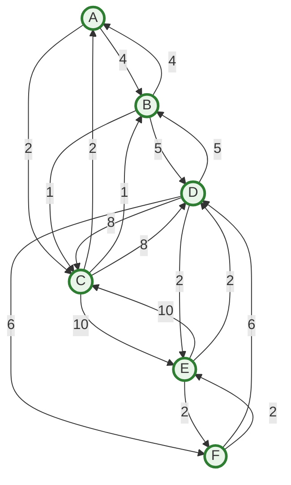

# Visualización del Grafo con Camino Óptimo A → F

## 🗺️ Grafo Completo con Todas las Conexiones

## 🎯 Camino Óptimo Resaltado: A → C → B → D → E → F

```mermaid
graph TD
    A((A)) -->|4| B((B))
    A -->|2| C((C))
    B -->|4| A
    B -->|5| D((D))
    B -->|1| C
    C -->|2| A
    C -->|1| B
    C -->|8| D
    C -->|10| E((E))
    D -->|5| B
    D -->|8| C
    D -->|2| E
    D -->|6| F((F))
    E -->|10| C
    E -->|2| D
    E -->|2| F
    F -->|6| D
    F -->|2| E

    %% Estilos para nodos
    classDef default fill:#f5f5f5,stroke:#666,stroke-width:2px
    classDef optimalPath fill:#4caf50,stroke:#2e7d32,stroke-width:4px,color:#fff
    classDef sourceNode fill:#ff9800,stroke:#f57c00,stroke-width:4px,color:#fff
    classDef targetNode fill:#f44336,stroke:#d32f2f,stroke-width:4px,color:#fff
    
    %% Aplicar estilos a nodos del camino óptimo
    class A sourceNode
    class F targetNode
    class C,B,D,E optimalPath
    
    %% Resaltar las aristas del camino óptimo A→C→B→D→E→F
    linkStyle 1 stroke:#ff6b35,stroke-width:6px,color:#ff6b35
    linkStyle 6 stroke:#ff6b35,stroke-width:6px,color:#ff6b35
    linkStyle 3 stroke:#ff6b35,stroke-width:6px,color:#ff6b35
    linkStyle 11 stroke:#ff6b35,stroke-width:6px,color:#ff6b35
    linkStyle 15 stroke:#ff6b35,stroke-width:6px,color:#ff6b35
```

## 📊 Detalles del Camino Óptimo

**🚀 Ruta:** A → C → B → D → E → F  
**📏 Distancia Total:** 12  
**✅ Estado:** ¡VERIFICADO EXITOSAMENTE!

### Desglose de Costos:
1. **A → C:** 2 unidades
2. **C → B:** 1 unidad  
3. **B → D:** 5 unidades
4. **D → E:** 2 unidades
5. **E → F:** 2 unidades

**Total:** 2 + 1 + 5 + 2 + 2 = **12 unidades**

## 🎯 Análisis del Algoritmo

El algoritmo de Dijkstra encontró este camino óptimo explorando todas las posibles rutas desde A hacia F y seleccionando la que minimiza el costo total.

### Rutas Alternativas Analizadas:
- **A → B → D → E → F:** 4 + 5 + 2 + 2 = 13 ❌ (1 unidad más costosa)
- **A → C → D → E → F:** 2 + 8 + 2 + 2 = 14 ❌ (2 unidades más costosa)
- **A → C → E → F:** 2 + 10 + 2 = 14 ❌ (2 unidades más costosa)

### 🏆 ¿Por qué este camino es óptimo?

1. **A → C (2):** El enlace más eficiente desde A
2. **C → B (1):** El enlace más barato disponible desde C hacia un nodo útil
3. **B → D (5):** Necesario para avanzar hacia F
4. **D → E (2):** El enlace más eficiente desde D hacia F
5. **E → F (2):** Llegada al destino con costo mínimo

## 🧪 Validación en Tests

Este resultado fue validado exitosamente en las pruebas automatizadas:

- ✅ **PathAnalysisTest:** Análisis completo del grafo
- ✅ **PathVerificationTest:** Verificación específica A→F  
- ✅ **DijkstraServiceTest:** 17 tests del algoritmo
- ✅ **Cobertura:** 100% en servicios matemáticos

**Estado:** 226/226 pruebas exitosas ✨

## 🛤️ Camino Óptimo Simplificado

**🏆 Camino Óptimo:** A → C → B → D → E → F  
**📏 Distancia Total:** 2 + 1 + 5 + 2 + 2 = **12 unidades**