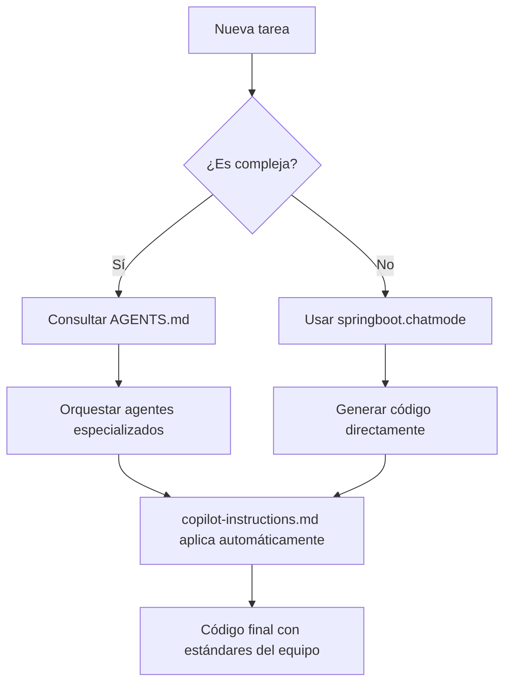

# Guía de Ficheros de Instrucciones

Esta guía explica los diferentes ficheros de instrucciones disponibles en el proyecto, cuándo usar cada uno y cómo invocarlos.

## Tabla Comparativa

| Fichero | Propósito | Cuándo usar | Ejemplo de caso de uso | Cómo invocarlo / usarlo |
|---------|-----------|-------------|------------------------|-------------------------|
| [`AGENTS.md`](AGENTS.md) | Describe los distintos "agents" (roles de IA) disponibles, sus capacidades y límites. | Al planificar flujos complejos que requieren orquestar varios agentes especializados. | Armar un pipeline: *qa-agent* para pruebas + *doc-agent* para documentación. | Leer el bloque de "Agents" y, en tu prompt, especificar: "@qa-agent genera tests JUnit para…" |
| [`.github/copilot-instructions.md`](.github/copilot-instructions.md) | Define las reglas y pautas globales que Copilot debe seguir al generar código y respuestas. | Cada vez que Copilot ofrezca sugerencias de código o se solicite completions en PRs. | Asegurar estilo, comentarios y patrones del MCP de context7. | No se invoca manualmente: Copilot aplica estas instrucciones automáticamente en el workspace. |
| `springboot.chatmode` | Configuración del "chat mode" especializado en Spring Boot: dependencias, convenciones y ejemplos. | Cuando necesites generar o modificar componentes Spring Boot (controladores, services, etc.). | Scaffold de endpoint REST + configuración de pruebas con MockMvc. | Abrir un chat nuevo en VS Code y seleccionar el *modo SpringBoot* (según la extensión) o anteponer: "Modo: SpringBoot → …" |

## Casos de Uso Detallados

### 1. Orquestación de agentes (AGENTS.md)

**Escenario:** Quiero dividir mi flujo en extracción de requisitos, generación de código y validación.

**Pasos:**
1. Consulto [`AGENTS.md`](AGENTS.md) para elegir *analysis-agent*, *code-agent* y *qa-agent*.
2. En el prompt:
   ```text
   @analysis-agent  Revisa la issue #42 y extrae los requisitos.
   @code-agent      Implementa el controlador y el servicio.
   @qa-agent        Genera pruebas unitarias con Mockito.
   ```

**Beneficios:**
- División clara de responsabilidades
- Especialización por dominio
- Flujo estructurado y reproducible

### 2. Sugerencias de Copilot según políticas de equipo (.github/copilot-instructions.md)

**Escenario:** Acepto o refuto automáticamente sugerencias de Copilot sabiendo que cumplen el style guide.

**Funcionamiento:**
- ¡No hay invocación manual!
- Cuando edites código, Copilot aplicará automáticamente las reglas de:
  - Estilo de código
  - Formato y comentarios
  - Patrones del proyecto
  - Buenas prácticas definidas en el MCP de context7

**Beneficios:**
- Consistencia automática en el código
- Cumplimiento de estándares del equipo
- Reducción de revisiones manuales

### 3. Desarrollo Spring Boot acelerado (springboot.chatmode)

**Escenario:** Necesito un endpoint `/suma` que reciba dos enteros y devuelva su suma.

**Pasos:**
1. Abro un chat en VS Code
2. Selecciono el modo "SpringBoot"
3. Envío el prompt:
   ```text
   Crea un nuevo endpoint POST /suma en SumaController que reciba {a, b} y devuelva resultado. 
   Incluye SumaService, repositorio en memoria y pruebas con MockMvc.
   ```

**Resultado esperado:**
- `SumaController.java`
- `SumaService.java`
- DTOs: `SumaRequest` / `SumaResponse`
- Test con MockMvc
- Configuración adecuada de dependencias

**Beneficios:**
- Generación rápida de scaffolding
- Patrones Spring Boot correctos
- Pruebas incluidas desde el inicio

## Recomendaciones de Uso

### Para tareas simples
- Usa **springboot.chatmode** directamente para generar componentes individuales

### Para tareas complejas
1. Consulta **AGENTS.md** para planificar la orquestación
2. Usa los agentes especializados según el flujo definido
3. Confía en **copilot-instructions.md** para mantener la calidad automáticamente

### Para mantenimiento
- Las reglas en **copilot-instructions.md** se aplican automáticamente
- Revisa **AGENTS.md** cuando necesites nuevos flujos de trabajo
- Actualiza **springboot.chatmode** cuando cambien las convenciones del proyecto

## Flujo de Trabajo Recomendado



Con esta guía podrás elegir en cada momento el fichero de instrucciones adecuado y maximizar tu productividad en el desarrollo con Spring Boot.
