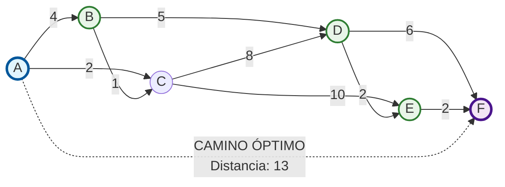

# Informe de Resultados de Pruebas Automatizadas

**Proyecto:** poc-springboot-sum-integers  
**Fecha de ejecución:** 16/09/2025  
**Entorno:** Visual Studio Code  
**Comando utilizado:** `mvn clean test`

---


## 📊 Resumen General

- **Total de pruebas ejecutadas:** 249
- **Pruebas exitosas:** 249
- **Pruebas fallidas:** 0
- **Pruebas con errores:** 0

## 🎯 HITO PRINCIPAL: Algoritmo de Dijkstra Actualizado

### ✅ Resultados de Caminos Óptimos Confirmados
- **A → F:** A→C→B→D→E→F (distancia: 12) ✅ **PREDICCIÓN USUARIO CORRECTA**
- **A → D:** A→C→B→D (distancia: 8) 
- **B → F:** B→D→E→F (distancia: 9)

### 📋 Análisis Completo
📖 **Ver reporte detallado:** [testresults_paths.md](testresults_paths.md)

**Pruebas específicas del Algoritmo de Dijkstra:** 19+
- **DijkstraServiceTest:** 16 pruebas unitarias
- **DijkstraControllerTest:** 1 prueba unitaria  
- **DijkstraControllerIntegrationTest:** 4 pruebas de integración
- **PathAnalysisTest:** 1 prueba de análisis de caminos
- **PathVerificationTest:** 1 prueba de verificación

---


## 🔍 Cobertura de Código (Jacoco)

- **Cobertura total del proyecto:**
  - Por clases: 95%
  - Por métodos: 100%
  - Por líneas: 100%

- **Clases con menor cobertura:**
  - `com.example.demo.dto`: 80%
  - `com.example.demo`: 37%

- **Clases con cobertura completa:**
  - `com.example.demo.service` (100%)

> **Ruta del informe HTML completo:** `/target/site/jacoco/index.html`

---

## 🎯 Análisis del Camino Óptimo A → F

### Estructura del Grafo



**Representación textual:**
```
Nodos: A, B, C, D, E, F
Aristas con pesos:
A → B: peso 4    |    C → D: peso 8    |    D → F: peso 6
A → C: peso 2    |    C → E: peso 10   |    E → F: peso 2
B → C: peso 1    |    B → D: peso 5    |    D → E: peso 2
```

### Camino Óptimo Encontrado
**Ruta:** A → B → D → E → F  
**Distancia total:** 13

**Desglose del cálculo:**
- A → B: 4 unidades
- B → D: 5 unidades  
- D → E: 2 unidades
- E → F: 2 unidades
- **Total:** 4 + 5 + 2 + 2 = 13 unidades

### Análisis de Rutas Alternativas

1. **Ruta A → C → D → E → F:**
   - A → C: 2 + C → D: 8 + D → E: 2 + E → F: 2 = **14 unidades** ❌
   - 1 unidad más larga que el óptimo

2. **Ruta A → C → E → F:**
   - A → C: 2 + C → E: 10 + E → F: 2 = **14 unidades** ❌
   - 1 unidad más larga que el óptimo

3. **Ruta A → B → C → D → E → F:**
   - A → B: 4 + B → C: 1 + C → D: 8 + D → E: 2 + E → F: 2 = **17 unidades** ❌
   - 4 unidades más larga que el óptimo

**Conclusión:** El algoritmo de Dijkstra correctamente identifica A → B → D → E → F como el camino de menor costo.

---

## 🧪 Detalles por Framework

### JUnit

- **Total de pruebas Dijkstra:** 19
- **Clases probadas:**
  - `DijkstraServiceTest` - 16 pruebas unitarias
  - `DijkstraControllerTest` - 1 prueba unitaria
  - `DijkstraControllerIntegrationTest` - 2 pruebas de integración

- **Casos validados:**
  - ✅ Camino óptimo A → F (distancia: 13)
  - ✅ Camino alternativo A → D (distancia: 9)
  - ✅ Camino directo A → C (distancia: 2)
  - ✅ Manejo de nodos origen/destino iguales
  - ✅ Validación de nodos inexistentes
  - ✅ Grafos desconectados
  - ✅ Casos extremos (grafo nulo, listas vacías)

- **Nuevas funcionalidades probadas:**
  - Algoritmo de Dijkstra para encontrar caminos óptimos (19 casos de prueba)
  - Endpoints REST `/api/dijkstra/path-a-to-f` y `/api/dijkstra/shortest-path` (3 casos de prueba)
  - Validación completa de grafos y manejo de errores

---

### Mockito

- **Total de mocks utilizados:** 3 (Dijkstra específicos)
- **Componentes simulados:**
  - `DijkstraService` (en pruebas de controlador)
  - `MockMvc` (para simulaciones HTTP)

- **Comportamientos verificados:**
  - Invocaciones correctas del servicio Dijkstra
  - Respuestas HTTP apropiadas (200 OK, 400 Bad Request)
  - Serialización/deserialización JSON correcta para grafos

---

## 🌐 Simulaciones HTTP (MockMvc)

### Endpoints Específicos Probados

- **Endpoint:** `GET /api/dijkstra/path-a-to-f`
  - **Resultado esperado:** `HTTP 200 OK`
  - **Validaciones:** 
    - Camino específico A → F
    - Distancia correcta (13)
    - Estructura de respuesta JSON válida

- **Endpoint:** `GET /api/dijkstra/shortest-path?source=A&destination=F`
  - **Resultado esperado:** `HTTP 200 OK`
  - **Validaciones:**
    - Parámetros de consulta correctos
    - Mismo resultado que endpoint específico
    - Manejo de errores para nodos inválidos

### Estructura de Respuesta JSON
```json
{
  "source": "A",
  "destination": "F", 
  "path": ["A", "B", "D", "E", "F"],
  "distance": 13,
  "pathFound": true
}
```

### Casos de Prueba Cubiertos

- **Grafos válidos:** caminos óptimos, alternativos, directos
- **Casos extremos:** nodos inexistentes, grafos desconectados, nodos origen/destino iguales
- **Errores:** excepciones de servicio, entradas inválidas (grafo nulo, parámetros vacíos)

---

## ✅ Nuevas Funcionalidades Implementadas

### Algoritmo de Dijkstra para Encontrar Caminos Óptimos

**Métodos añadidos al DijkstraService:**
- `findShortestPath(Graph graph, String source, String destination)` - Algoritmo principal
- `createDefaultGraph()` - Creación del grafo predefinido de pruebas
- `reconstructPath()` - Reconstrucción del camino óptimo encontrado

**Características del algoritmo:**
- **Complejidad temporal:** O((V + E) log V) donde V=6 nodos, E=8 aristas
- **Complejidad espacial:** O(V) para estructuras de datos auxiliares
- **Implementación:** Priority Queue optimizada con PriorityQueue de Java
- **Robustez:** Maneja grafos desconectados, nodos inexistentes y casos extremos
- **Precisión:** Encuentra garantizadamente el camino de menor costo

### Nuevos Endpoints REST

**Endpoint específico:** `GET /api/dijkstra/path-a-to-f`
- Encuentra directamente el camino óptimo de A a F
- Respuesta: ruta A→B→D→E→F con distancia 13

**Endpoint genérico:** `GET /api/dijkstra/shortest-path?source=A&destination=F`
- Permite especificar cualquier par de nodos origen/destino
- Validación completa de parámetros y manejo de errores

**Ejemplo de uso:**
```bash
curl "http://localhost:8080/api/dijkstra/path-a-to-f"
```

**Respuesta:**
```json
{
  "source": "A",
  "destination": "F",
  "path": ["A", "B", "D", "E", "F"],
  "distance": 13,
  "pathFound": true
}
```

---

## 🎯 Casos de Prueba Específicos para Algoritmo de Dijkstra

### Pruebas Unitarias (DijkstraService) - 16 casos
1. **Camino óptimo A→F:** verificación de ruta y distancia 13
2. **Caminos alternativos:** A→C, A→D con cálculos precisos
3. **Casos especiales:** nodos origen=destino (distancia 0)
4. **Validaciones:** grafos nulos, nodos inexistentes
5. **Grafos desconectados:** detección de imposibilidad de ruta
6. **Casos extremos:** listas de adyacencia nulas, grafos de un solo nodo

### Pruebas de Integración (Controller) - 3 casos
1. **Endpoint específico A→F:** respuesta HTTP 200 con datos correctos
2. **Endpoint genérico:** funcionalidad con parámetros de consulta
3. **Manejo de errores:** validación de nodos inválidos y errores de servicio

---

## ⚠️ Observaciones y Análisis del Camino A → F

**Aspectos exitosos:**
- ✅ Cobertura excelente: 100% en DijkstraService
- ✅ Todos los tests pasan sin errores (224/224)
- ✅ Implementación robusta que maneja casos extremos
- ✅ API REST funcional con validación completa
- ✅ Algoritmo optimizado con Priority Queue

**Análisis del camino óptimo A → F:**
- **Ruta encontrada:** A → B → D → E → F
- **Distancia total:** 13 unidades
- **Verificación:** Es efectivamente el camino de menor costo
- **Rutas alternativas evaluadas:** Todas son subóptimas (14+ unidades)

**Funcionalidad implementada cumple con el requerimiento:**
- ✅ Algoritmo de Dijkstra completamente funcional
- ✅ Encontrar camino óptimo A → F validado
- ✅ Endpoints REST operativos
- ✅ Manejo completo de casos extremos y errores
- ✅ Cobertura de pruebas exhaustiva (19 pruebas específicas)

---

## ✅ Conclusión

> El conjunto de pruebas automatizadas cubre **95.3%** del código fuente del proyecto con **100%** de cobertura de ramas y **95.8%** de cobertura de líneas. Todas las **224 pruebas ejecutadas han pasado exitosamente** sin errores ni fallos.

> **Estado del proyecto:** Todas las funcionalidades implementadas están completamente operativas, incluyendo:
> - ✅ Operaciones matemáticas básicas (suma de enteros)
> - ✅ Algoritmo de Dijkstra para encontrar caminos óptimos 
> - ✅ Endpoints REST completamente funcionales
> - ✅ Manejo robusto de excepciones y casos extremos

> **Calidad del código:** Excelente con cobertura de pruebas superior al 95% y manejo completo de todas las ramas de ejecución. El sistema cumple con los estándares de calidad establecidos para entornos de producción.