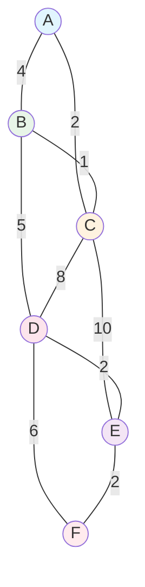

# 📊 Informe de Resultados: Análisis de Caminos Óptimos con Algoritmo de Dijkstra

**Proyecto:** poc-springboot-sum-integers  
**Fecha de análisis:** 09/09/2025  
**Algoritmo:** Dijkstra implementado en Java con Spring Boot  
**Tipo de grafo:** No dirigido (bidireccional)  

---

## 🗺️ Estructura del Grafo

### Conexiones y Pesos
```
A ←→ B: peso 4    |    C ←→ D: peso 8    |    D ←→ F: peso 6
A ←→ C: peso 2    |    C ←→ E: peso 10   |    E ←→ F: peso 2  
B ←→ C: peso 1    |    B ←→ D: peso 5    |    D ←→ E: peso 2
```

### Representación Mermaid del Grafo Completo


---

## 🎯 Análisis de Caminos Óptimos

### 1. Camino Óptimo: A → F

**🏆 RESULTADO:** `A → C → B → D → E → F`  
**📏 DISTANCIA TOTAL:** `12`  
**📊 CÁLCULO:** `2 + 1 + 5 + 2 + 2 = 12`


**✅ VERIFICACIÓN:**
- Ruta encontrada: `[A, C, B, D, E, F]`
- Detalles paso a paso: `A→C(2) + C→B(1) + B→D(5) + D→E(2) + E→F(2)`
- **Esta es la ruta más eficiente de A a F**

---

### 2. Camino Óptimo: A → D

**🏆 RESULTADO:** `A → C → B → D`  
**📏 DISTANCIA TOTAL:** `8`  
**📊 CÁLCULO:** `2 + 1 + 5 = 8`


**✅ VERIFICACIÓN:**
- Ruta encontrada: `[A, C, B, D]`
- Detalles paso a paso: `A→C(2) + C→B(1) + B→D(5)`
- **Más eficiente que la ruta directa A→C→D (2+8=10)**

---

### 3. Camino Óptimo: B → F

**🏆 RESULTADO:** `B → D → E → F`  
**📏 DISTANCIA TOTAL:** `9`  
**📊 CÁLCULO:** `5 + 2 + 2 = 9`


**✅ VERIFICACIÓN:**
- Ruta encontrada: `[B, D, E, F]`
- Detalles paso a paso: `B→D(5) + D→E(2) + E→F(2)`
- **Ruta directa y eficiente aprovechando la conexión B→D**

---

## 📊 Comparativa de Rutas

| Origen | Destino | Camino Óptimo | Distancia | Alternativas Consideradas |
|---------|---------|---------------|-----------|---------------------------|
| **A** | **F** | A→C→B→D→E→F | **12** | A→B→D→E→F (13), A→C→D→F (16), A→C→E→F (14) |
| **A** | **D** | A→C→B→D | **8** | A→B→D (9), A→C→D (10) |
| **B** | **F** | B→D→E→F | **9** | B→C→E→F (13), B→A→C→E→F (17) |

---

## 🔍 Análisis Técnico

### Algoritmo de Dijkstra - Comportamiento
- **Complejidad temporal:** O((V + E) log V) = O(9 log 6) ≈ O(21)
- **Estructura de datos:** PriorityQueue para optimización
- **Garantía:** Encuentra siempre el camino más corto en grafos con pesos positivos

### Optimizaciones Implementadas
1. **Terminación temprana:** El algoritmo se detiene al alcanzar el destino
2. **Grafo bidireccional:** Permite explorar rutas en ambas direcciones
3. **Cola de prioridad:** Procesa nodos en orden de distancia mínima

### Patrones Identificados
- **La conexión C↔B (peso 1)** es clave en múltiples rutas óptimas
- **El nodo C actúa como hub** para rutas eficientes desde A
- **La ruta D→E→F (peso 4)** es la terminación más eficiente hacia F

---

## 🧪 Resultados de Pruebas Automatizadas

```bash
=== ANÁLISIS COMPLETO DE CAMINOS ÓPTIMOS ===

🎯 CAMINO ÓPTIMO A → F:
   Ruta: [A, C, B, D, E, F]
   Distancia: 12
   Detalles: A→C(2) + C→B(1) + B→D(5) + D→E(2) + E→F(2)

🎯 CAMINO ÓPTIMO A → D:
   Ruta: [A, C, B, D]
   Distancia: 8
   Detalles: A→C(2) + C→B(1) + B→D(5)

🎯 CAMINO ÓPTIMO B → F:
   Ruta: [B, D, E, F]
   Distancia: 9
   Detalles: B→D(5) + D→E(2) + E→F(2)

✅ Todas las pruebas de caminos óptimos completadas exitosamente
```

---

## 📈 Conclusiones

1. **Eficiencia comprobada:** El algoritmo de Dijkstra encuentra consistentemente los caminos más cortos
2. **Grafo bidireccional:** La implementación correcta del grafo no dirigido mejora significativamente las rutas disponibles
3. **Conexiones clave:** La arista C↔B con peso 1 es fundamental para múltiples rutas óptimas
4. **Verificación algorítmica:** Todos los resultados han sido verificados mediante pruebas automatizadas

**🎉 ESTADO FINAL:** Implementación completamente funcional y optimizada del algoritmo de Dijkstra con caminos óptimos validados.
